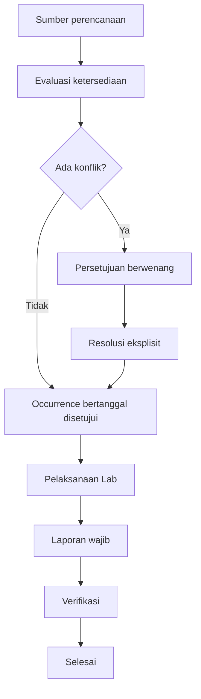
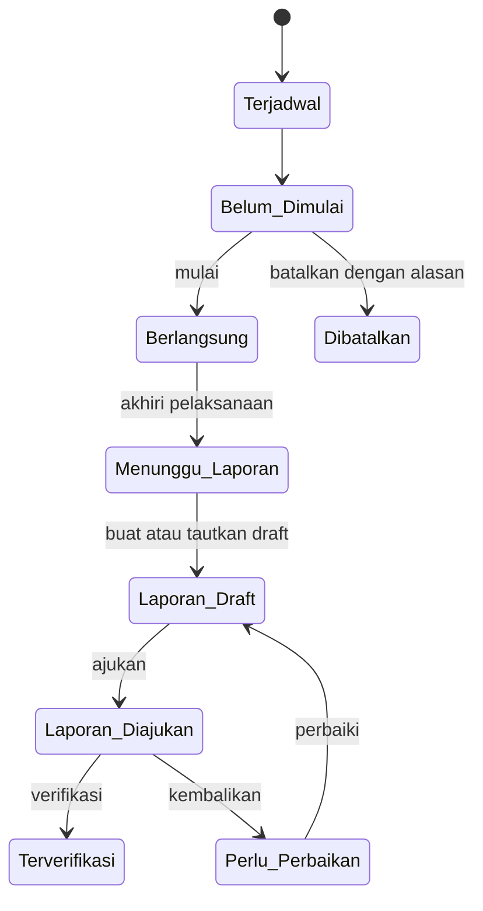
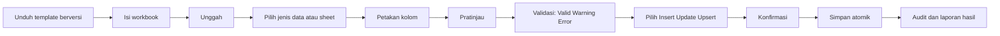
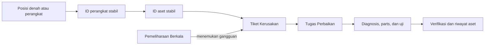

# Spesifikasi Workflow Operasional SmartLab

**Status:** Arah Produk Disetujui

**Version:** 1.0

**Updated:** 2026-07-30

**Product:** SmartLab PPLG

**Audiens:** pemilik produk, pimpinan sekolah, Kepala Lab, Admin Lab, guru, teknisi, pengembang, perancang, dan peninjau operasional.

Dokumen ini adalah sumber kebenaran untuk arah workflow operasional SmartLab. Ia menetapkan keputusan produk, bukan perubahan kode, route, kontrak, skema, konfigurasi, atau data. Setiap perubahan implementasi tetap memerlukan PR terfokus dan persetujuan manusia sebelum digabungkan.

| Daftar isi | Bagian |
| --- | --- |
| 1 | [Tujuan dan batas teknis](#1-tujuan-dan-batas-teknis) |
| 2 | [Terminologi dan navigasi](#2-terminologi-dan-navigasi) |
| 3 | [Peran dan tanggung jawab](#3-peran-dan-tanggung-jawab) |
| 4 | [Ketersediaan, jadwal, reservasi, dan prioritas](#4-ketersediaan-jadwal-reservasi-dan-prioritas) |
| 5 | [Pelaksanaan Lab dan laporan](#5-pelaksanaan-lab-dan-laporan) |
| 6 | [Denah laboratorium](#6-denah-laboratorium) |
| 7 | [Tema tampilan](#7-tema-tampilan) |
| 8 | [Master Data dan import Excel](#8-master-data-dan-import-excel) |
| 9 | [Perangkat, aset, incident, dan perbaikan](#9-perangkat-aset-incident-dan-perbaikan) |
| 10 | [Kesenjangan implementasi saat ini](#10-kesenjangan-implementasi-saat-ini) |
| 11 | [Roadmap](#11-roadmap-implementasi) |
| 12 | [Definition of Done](#12-definition-of-done-pr-masa-depan) |
| 13 | [Log keputusan](#13-log-keputusan) |
| 14 | [Pertanyaan terbuka](#14-pertanyaan-terbuka) |

## Konvensi status

Setiap bagian memakai arti berikut agar rencana tidak dianggap sudah tersedia di aplikasi.

| Istilah | Arti |
| --- | --- |
| **Implementasi saat ini** | Perilaku yang dapat diamati pada frontend React saat ini. |
| **Perilaku target yang disetujui** | Hasil produk yang telah disepakati, tetapi belum otomatis diimplementasikan. |
| **Implementasi masa depan** | Pekerjaan dalam PR terfokus, lengkap dengan kontrak, migrasi, dan otorisasi bila diperlukan. |
| **Di luar scope PR dokumentasi** | Pekerjaan yang tidak boleh dilakukan hanya karena dokumen ini berubah. |

## 1. Tujuan dan batas teknis

SmartLab membantu sekolah merencanakan penggunaan laboratorium, menjalankan kegiatan, mencatat laporan, menautkan kerusakan pada perangkat/aset yang stabil, menangani perbaikan, dan menyimpan jejak operasional yang dapat dipertanggungjawabkan.

| Status | Keterangan |
| --- | --- |
| Implementasi saat ini | `apps/web` adalah frontend React dengan abstraksi repository dan persistensi browser lokal untuk prototipe. |
| Perilaku target yang disetujui | React web/PWA dengan shell Capacitor, Laravel REST API, PostgreSQL, Redis, Go Windows PC Agent, serta `packages/contracts` sebagai sumber kontrak HTTP dan realtime. |
| Implementasi masa depan | Backend menjadi sumber data dan otorisasi utama secara bertahap melalui vertical slice. |
| Di luar scope PR dokumentasi | Remote desktop, keylogging, screenshot, pengumpulan file pribadi, sistem akademik lengkap, pengadaan end-to-end, serta perubahan backend/API/skema. |

## 2. Terminologi dan navigasi

Istilah target memperjelas domain tanpa menghapus route atau catatan historis yang ada. Migrasi label, route, dan permission harus dilakukan dalam PR terfokus dengan redirect/deep link yang aman. Data sesi dan jurnal saat ini tidak boleh dihapus akibat perubahan istilah.

| Label saat ini | Label target disetujui | Tujuan | Bukan | Route saat ini | Catatan implementasi |
| --- | --- | --- | --- | --- | --- |
| Dashboard | Dashboard | Ringkasan operasional dan pengecualian. | Sumber transaksi utama. | `/dashboard` | Gunakan agregasi nyata pada tahap pelaporan. |
| Laboratorium | Laboratorium | Identitas, kapasitas, status, dan denah ruang. | Daftar inventaris perangkat. | `/laboratories` | Tambahkan lifecycle aman. |
| Jadwal Lab | Jadwal Reguler | Alokasi pembelajaran berulang. | Permohonan satu kali. | `/schedules` | Masukan ke layanan ketersediaan. |
| Booking Lab | Reservasi Lab | Permohonan penggunaan bertanggal di luar jadwal reguler. | Jadwal berulang atau override prioritas. | `/bookings` | Memiliki persetujuan. |
| Sesi Praktikum | Pelaksanaan Lab | Pelaksanaan pada tanggal tertentu dan rekam kegiatannya. | Entri kalender saja. | `/sessions` | Menyatukan pengalaman jurnal. |
| Jurnal Praktikum | Bagian dari Pelaksanaan Lab | Bukti/laporan satu pelaksanaan selesai. | Sumber alokasi ruang. | `/journals` | Data lama dipertahankan. |
| Monitoring PC | Monitoring Perangkat | Kesehatan, identitas, status, dan alert perangkat. | Registrasi aset tetap. | `/monitoring` | Beralih dari simulasi ke telemetry yang disetujui. |
| Inventaris | Aset Tetap | Aset tahan lama per unit. | Stok habis pakai. | `/assets` | Tautan perangkat/aset stabil. |
| Persediaan | Stok & Spare Part | Kuantitas bahan habis pakai dan suku cadang. | Aset tetap per unit. | `/stock` | Transaksi backend kemudian. |
| Laporan Kerusakan | Tiket Kerusakan | Isu, dampak, triage, dan riwayat penyelesaian. | Tugas perbaikan. | `/incidents` | Tautkan perangkat/aset bila relevan. |
| Work Order | Tugas Perbaikan | Pekerjaan korektif yang ditugaskan. | Rencana pemeliharaan berkala. | `/work-orders` | Dapat berasal dari tiket. |
| Maintenance | Pemeliharaan Berkala | Pekerjaan preventif dan checklist. | Tiket reaktif. | `/maintenance` | Menjadi sumber penutupan ketersediaan. |
| Peminjaman | Peminjaman Barang | Penyerahan, penguasaan, dan pengembalian barang. | Reservasi ruang. | `/loans` | Pertahankan riwayat serah-terima. |
| Kalender Akademik | Kalender Akademik | Tanggal akademik dan penutupan. | Mesin alokasi laboratorium. | `/calendar` | Memberi closure/exception. |
| Laporan dan Analitik | Laporan & Analitik | Filter, ekspor, dan ringkasan keputusan. | Penyuntingan operasional langsung. | `/reports` | Berdasar data tervalidasi. |
| Notifikasi | Notifikasi | Pesan tindakan untuk penerima. | Audit log yang tidak dapat diubah. | `/notifications` | Deep link harus valid. |
| Pengguna | Pengguna | Akun yang dapat login. | Seluruh master guru. | `/users` | Guru dapat tanpa akun; teknisi/admin dapat tanpa data guru. |
| Role dan Permission | Hak Akses | Administrasi role dan permission. | Batas keamanan tunggal. | `/roles` | Laravel Policies tetap utama. |
| Master Data | Master Data | Referensi terkontrol dan master akademik. | Akun pengguna. | `/master-data` | Import bertahap. |
| Audit Log | Audit Log | Bukti perubahan material yang append-oriented. | Kotak masuk notifikasi. | `/audit-logs` | Perlu cakupan backend. |
| Pengaturan | Pengaturan | Konfigurasi sekolah dan produk. | Jalan pintas kebijakan operasional. | `/settings` | Menjadi konfigurasi tenant-aware. |

| Kelompok navigasi target | Menu |
| --- | --- |
| Operasional | Dashboard, Laboratorium, Jadwal Reguler, Reservasi Lab, Pelaksanaan Lab |
| Aset dan Pemeliharaan | Monitoring Perangkat, Aset Tetap, Stok & Spare Part, Tiket Kerusakan, Tugas Perbaikan, Pemeliharaan Berkala, Peminjaman Barang |
| Informasi | Kalender Akademik, Laporan & Analitik, Notifikasi |
| Administrasi | Pengguna, Hak Akses, Master Data, Audit Log, Pengaturan |

| Status | Keterangan |
| --- | --- |
| Implementasi saat ini | Label dan route masih mengikuti tabel kolom pertama. |
| Perilaku target yang disetujui | Jadwal Reguler berbeda dari Reservasi Lab; pelaksanaan berbeda dari laporan; monitoring berbeda dari aset; aset tetap berbeda dari stok; tiket berbeda dari tugas perbaikan dan pemeliharaan; notifikasi berbeda dari audit. |
| Implementasi masa depan | PR navigasi memigrasikan label, permission, dan deep link tanpa menghapus data. |
| Di luar scope PR dokumentasi | Mengganti route, menghapus menu, atau menghapus sesi/jurnal. |

## 3. Peran dan tanggung jawab

Role aktual SmartLab adalah **Super Admin, Admin Lab, Kepala Lab, Teknisi, Guru, Ketua Kelas, Siswa,** dan **Pimpinan**. Matriks ini adalah arah operasional; nama permission granular selain proposal yang disebutkan belum final.

Keterangan: **Ya** = pelaku utama; **Terbatas** = hanya data/ruang miliknya atau melalui alur; **Read-only** = melihat tanpa mengubah; **Tidak** = tidak diberi tindakan; **Proposed / perlu finalisasi** = kebijakan belum dikunci.

| Tindakan | Super Admin | Admin Lab | Kepala Lab | Teknisi | Guru | Ketua Kelas | Siswa | Pimpinan |
| --- | --- | --- | --- | --- | --- | --- | --- |
| Melihat jadwal | Ya | Ya | Ya | Ya | Ya | Ya | Ya | Read-only |
| Membuat Jadwal Reguler | Ya | Ya | Ya | Tidak | Terbatas | Tidak | Tidak | Tidak |
| Mengajukan Reservasi Lab | Ya | Ya | Ya | Terbatas | Ya | Terbatas | Terbatas | Tidak |
| Menyetujui Reservasi Lab | Ya | Ya | Ya | Tidak | Tidak | Tidak | Tidak | Tidak |
| Menyetujui override kegiatan prioritas | Ya | Proposed / perlu finalisasi | Proposed / perlu finalisasi | Tidak | Tidak | Tidak | Tidak | Read-only |
| Memulai Pelaksanaan Lab | Ya | Ya | Ya | Terbatas | Ya | Terbatas | Tidak | Tidak |
| Mengakhiri Pelaksanaan Lab | Ya | Ya | Ya | Terbatas | Ya | Terbatas | Tidak | Tidak |
| Mengisi dan mengajukan laporan | Ya | Ya | Ya | Terbatas | Ya | Terbatas | Tidak | Tidak |
| Memverifikasi laporan | Ya | Ya | Ya | Tidak | Tidak | Tidak | Tidak | Read-only |
| Membuat Tiket Kerusakan | Ya | Ya | Ya | Ya | Ya | Ya | Terbatas | Tidak |
| Menugaskan teknisi | Ya | Ya | Ya | Tidak | Tidak | Tidak | Tidak | Tidak |
| Mengerjakan Tugas Perbaikan | Ya | Terbatas | Terbatas | Ya | Tidak | Tidak | Tidak | Tidak |
| Mengelola denah | Ya | Ya | Ya | Terbatas | Tidak | Tidak | Tidak | Read-only |
| Import Master Data | Ya | Ya | Terbatas | Tidak | Tidak | Tidak | Tidak | Tidak |
| Import jadwal | Ya | Ya | Ya | Tidak | Terbatas | Tidak | Tidak | Tidak |
| Mengubah preferensi tema pribadi | Ya | Ya | Ya | Ya | Ya | Ya | Ya | Ya |
| Mengubah pengaturan global | Ya | Ya | Terbatas | Tidak | Tidak | Tidak | Tidak | Read-only |

Proposal permission `reservations.override` hanya contoh untuk override prioritas dan harus difinalisasi bersama kontrak. **Laravel Policies dan validasi server adalah batas keamanan yang otoritatif; guard frontend hanya membantu pengalaman pengguna.**

| Status | Keterangan |
| --- | --- |
| Implementasi saat ini | Frontend memiliki role aktual di atas dan matriks permission tersimpan untuk menu, halaman, serta aksi. |
| Perilaku target yang disetujui | Tindakan sensitif mengikuti matriks dan kebijakan sekolah, terutama persetujuan override. |
| Implementasi masa depan | Finalisasi permission granular, kebijakan backend, dan audit otorisasi. |
| Di luar scope PR dokumentasi | Mengubah role, permission, atau kebijakan aplikasi saat ini. |

## 4. Ketersediaan, jadwal, reservasi, dan prioritas

Jadwal Reguler dan Reservasi Lab tetap domain terpisah: yang pertama alokasi berulang pembelajaran, yang kedua permohonan bertanggal. Kegiatan prioritas adalah aktivitas bertanggal yang disetujui, misalnya TKA, ANBK, ujian, sertifikasi, LKS, workshop, atau kegiatan lain yang diotorisasi.



Layanan ketersediaan terpadu mengevaluasi jadwal berulang, reservasi, kegiatan prioritas, penutupan pemeliharaan, penutupan laboratorium, dan `ScheduleException`. Ia mendeteksi tumpang tindih laboratorium/guru/kelas, occurrence ganda, lab tidak aktif, ketidaksesuaian kapasitas, penutupan pemeliharaan, dan konflik reservasi yang disetujui.

Override prioritas selalu bertanggal; jadwal berulang tidak pernah dihapus. Setiap occurrence terdampak dipratinjau, disetujui pihak berwenang, memiliki resolusi eksplisit, mengirim notifikasi, dan tercatat di audit. Pembatalan mengembalikan perilaku occurrence normal bila memungkinkan. Pilihan resolusi: membatalkan tanggal terdampak saja, memindahkan laboratorium, menjadwalkan ulang tanggal/waktu, mengganti dengan kegiatan prioritas, atau mempertahankan bila tidak ada konflik sumber daya nyata. Pemohon tidak dapat meng-override alokasi.

`SpecialEvent` secara konseptual memiliki ID stabil, jenis, judul, waktu, lab, pemohon, status persetujuan, alasan, dan referensi audit. `ScheduleException` memiliki ID stabil, ID jadwal, tanggal occurrence, resolusi, pengganti bila ada, penyetuju, alasan, dan referensi audit.

| Status | Keterangan |
| --- | --- |
| Implementasi saat ini | Jadwal dan booking tersimpan sebagai koleksi frontend terpisah; pemeriksaan booking hanya membandingkan booking lain pada layar tersebut. |
| Perilaku target yang disetujui | Satu layanan ketersediaan memutuskan semua konflik tanpa mengaburkan domain Jadwal Reguler dan Reservasi Lab. |
| Implementasi masa depan | Domain availability di API dengan validasi transaksi, `SpecialEvent`, dan `ScheduleException`. |
| Di luar scope PR dokumentasi | Menganggap validasi browser sebagai jaminan konkurensi atau otorisasi. |

## 5. Pelaksanaan Lab dan laporan

Prinsip yang dikunci: **satu menu, satu workflow pengguna, dua entitas domain terkait, satu laporan wajib.** Secara konseptual relasinya adalah `Session 1 — 1 ActivityReport`. Pelaksanaan yang dibatalkan boleh tidak memiliki laporan.

Tab target: **Hari Ini**, **Sedang Berlangsung**, **Menunggu Laporan**, dan **Riwayat & Laporan**. Status target: **Terjadwal**, **Belum Dimulai**, **Berlangsung**, **Menunggu Laporan**, **Laporan Draft**, **Laporan Diajukan**, **Perlu Perbaikan**, **Terverifikasi**, dan **Dibatalkan**.



Ketika pelaksanaan diakhiri, sistem mencatat waktu akhir aktual, mengubah status ke Menunggu Laporan, membuat atau menautkan draft, membawa pengguna ke formulir, dan memungkinkan draft disimpan/dilanjutkan. Pelaksanaan belum sepenuhnya selesai sampai kebijakan pelengkapan/verifikasi laporan terpenuhi. Waktu pengingat tetap dapat dikonfigurasi dan masih terbuka.

| Varian laporan | Bagian bersama dan khusus |
| --- | --- |
| Jurnal Praktikum | Tujuan, mapel/topik, kelas, guru, kehadiran, bahan/perangkat lunak, langkah, kondisi awal/akhir, kendala, referensi tiket, lampiran, refleksi, verifikasi. |
| Laporan Pelaksanaan TKA/ANBK/Ujian | Jenis kegiatan, peserta/kelas, jadwal, proktor/teknisi, kesiapan perangkat, kehadiran, keberlanjutan/incident, akomodasi, bukti, verifikasi. |
| Laporan Workshop/Pelatihan | Penyelenggara, peserta, agenda, fasilitator, sumber daya, kehadiran, keluaran, kendala, lampiran, verifikasi. |
| Laporan Kegiatan Umum | Klasifikasi, pemilik kegiatan, tujuan, peserta, penggunaan ruang/peralatan, hasil, kendala, lampiran, verifikasi. |

Laporan manual hanya untuk backfill, migrasi, darurat, atau data legacy yang diizinkan; alasan dan sumber wajib dicatat. Tidak boleh ada penghapusan diam-diam atau tautan palsu ke pelaksanaan.

| Status | Keterangan |
| --- | --- |
| Implementasi saat ini | Sesi Praktikum dan Jurnal Praktikum adalah menu/route terpisah; menyelesaikan sesi dapat membuat jurnal draft. |
| Perilaku target yang disetujui | Pengguna mengalami satu workflow Pelaksanaan Lab dengan laporan wajib dan verifikasi. |
| Implementasi masa depan | Antarmuka terpadu, migrasi terkontrol, status, draft, notifikasi terkonfigurasi, dan kebijakan verifikasi. |
| Di luar scope PR dokumentasi | Menghapus jurnal/sesi lama atau menetapkan SLA pengingat yang belum disetujui. |

## 6. Denah laboratorium

Jenis denah yang didukung tepatnya: **Grid Klasik, Perimeter + Center Island, U-Shape, Facing Rows,** dan **Custom**. Tipe elemen persisten: `student_pc`, `teacher_pc`, `teacher_desk`, `projector`, `printer`, `network_switch`, `access_point`, `door`, `window`, `wall`, `aisle`, `label`, dan `empty`.

Model konseptual:

| `LaboratoryLayout` | `LayoutElement` |
| --- | --- |
| `id`, `laboratoryId`, `name`, `layoutType`, `rows`, `columns`, `version`, `isActive`, `status` | `id`, `layoutId`, `type`, `referenceId`, `label`, `row`, `column`, `rowSpan`, `columnSpan`, `rotation`, `movable`, `swappable`, `fixed` |

Aturan perpindahan yang dikunci:

| Sumber dan target | Perilaku target |
| --- | --- |
| `student_pc` ke `empty` | Pindahkan; sumber menjadi `empty`. |
| `student_pc` ke `student_pc` | Lakukan **atomic swap langsung saat drop**; kedua posisi bertukar dan koordinat duplikat tidak boleh ada. |
| `student_pc` ke elemen non-PC | Tolak dengan pesan jelas. |
| Elemen non-PC yang dapat dipindah ke `empty` | Izinkan bila konfigurasi elemen mengizinkan. |
| Elemen non-PC ke slot terisi | Tolak; tidak ada auto-swap. |
| Elemen fixed | Tidak dapat dipindah. |
| `teacher_pc` | Berbeda dari `student_pc`; boleh ke slot kosong yang kompatibel, tidak otomatis bertukar dengan PC siswa. |

Syarat integritas: posisi terisi unik; satu elemen aktif per sel kecuali spanning yang disengaja; referensi perangkat stabil; perpindahan tidak mengubah identitas perangkat/aset; penyimpanan atomik; collision ditolak; audit dicatat; migrasi dari koordinat grid saat ini direncanakan; dan mode monitoring hanya-baca.

Contoh berikut konseptual, bukan rekreasi pixel-perfect. Ia menunjukkan PC Guru di kiri atas, pintu masuk di kanan atas, PC-1 s.d. PC-9 pada tepi kanan, PC-10 s.d. PC-18 di tengah kanan, PC-19 s.d. PC-27 di tengah kiri, PC-28 s.d. PC-36 pada tepi kiri, dengan lorong jelas antarkelompok.

```text
[PC Guru] [Meja Guru]                 [Pintu Masuk]

[PC-28]    [PC-19][PC-20][PC-21]      [PC-10][PC-11][PC-12]    [PC-1]
[PC-29]    [PC-22][PC-23][PC-24]      [PC-13][PC-14][PC-15]    [PC-2]
[PC-30]    [PC-25][PC-26][PC-27]      [PC-16][PC-17][PC-18]    [PC-3]
[PC-31]          lorong lebar dan jelas                            [PC-4]
[PC-32]                                                       [PC-5]
[PC-33]  [Printer] [Switch] [Access Point]                    [PC-6]
[PC-34]                                                       [PC-7]
[PC-35]  [Projector/Display]                                  [PC-8]
[PC-36]                                                       [PC-9]
```

| Status | Keterangan |
| --- | --- |
| Implementasi saat ini | Denah memakai dimensi grid dan pembaruan posisi perangkat; elemen non-PC belum menjadi model persisten penuh. |
| Perilaku target yang disetujui | Multi-template, elemen persisten, aturan drop di atas, integritas posisi, dan monitoring read-only. |
| Implementasi masa depan | Model data, migrasi koordinat, editor, atomic save, audit, serta pengujian collision dan swap. |
| Di luar scope PR dokumentasi | Mengubah editor denah atau perilaku drag-drop saat ini. |

## 7. Tema tampilan

Tema target mencakup **Light, Dark,** dan **System**. Preferensi persisten per pengguna/perangkat yang sesuai; startup tidak memaksa Dark; System mengikuti preferensi OS dan mendengarkan perubahan OS tanpa reload. Topbar memiliki toggle cepat Light/Dark, sedangkan Pengaturan menyediakan pilihan lengkap Light/Dark/System.

Tema diterapkan sebelum render normal untuk mencegah flash tema salah. Sidebar, topbar, kartu, formulir, tabel, modal, drawer, toast, login, empty state, loading state, scrollbar, dan hasil cetak mendukung kedua tema. Chart tidak boleh memakai warna tooltip, grid, axis, atau label hard-coded hanya untuk Dark. Fokus terlihat dan kontras harus aksesibel.

| Status | Keterangan |
| --- | --- |
| Implementasi saat ini | UI store mendukung `light`, `dark`, dan `system`, serta menyimpan preferensi; namun bootstrap aplikasi menjalankan `applyTheme('dark')` setelah hidrasi. Listener perubahan tema OS dan toggle cepat topbar belum ada. |
| Perilaku target yang disetujui | Preferensi dihormati sejak awal render; System responsif terhadap OS; seluruh komponen dan chart sadar tema. |
| Implementasi masa depan | PR `feat/complete-theme-support` mengatur bootstrap bebas flash, listener `matchMedia`, token chart/print, toggle topbar, dan regresi aksesibilitas. |
| Di luar scope PR dokumentasi | Mengubah CSS, bootstrap, chart, atau pengaturan aplikasi pada PR ini. |

## 8. Master Data dan import Excel

### 8.1 Master Data

Master referensi sederhana: **Kategori Aset, Model Aset, Kondisi Aset, Status Aset, Kategori Incident, Supplier, Satuan,** dan **Lokasi Stok**. Bidang umum: `code`, `name`, dan status aktif.

| Master akademik | Bidang target |
| --- | --- |
| Guru | kode/NIP, nama, email, telepon, program/unit, status aktif |
| Kelas | kode, nama, tingkat, program, wali kelas, jumlah siswa, status aktif |
| Mata Pelajaran | kode, nama, kelompok, program, status aktif |
| Jam Pelajaran | kode, urutan, jam mulai, jam selesai, jenis KBM/istirahat, status aktif |
| Tahun Ajaran | kode, nama, tanggal mulai, tanggal selesai, status aktif |
| Semester | tahun ajaran, nama, tanggal mulai, tanggal selesai, status aktif |
| Laboratorium | kode, nama, lokasi, kapasitas, kepala lab, teknisi, jumlah PC, tipe denah, baris, kolom, status |

Bidang ingestion jadwal yang dibutuhkan secara semantik: tahun ajaran, semester, stable source schedule ID, recurrence mingguan/tanggal tunggal, JP mulai, JP selesai, lab terencana opsional, stable teacher/class/subject references, jenis kegiatan, source publication ID, dan source version.

**Prasyarat stable ID sudah terpenuhi.** ADR-001 menetapkan TESSELA sebagai authority published timetable, dan kontrak S2.1 menetapkan full-snapshot publication + materialized occurrence. Import Excel/file jadwal, bila tetap dibutuhkan, hanya boleh menjadi adapter terkontrol ke kontrak yang sama; ia tidak boleh menulis canonical regular schedule sebagai authority kedua.

### 8.2 Workflow import Excel



Perilaku wajib: template berversi; pencocokan kode stabil; validasi bidang wajib, duplikasi, referensi asing, tanggal/waktu, dan konflik jadwal; kesalahan per baris; laporan kesalahan yang dapat diunduh; hitungan inserted/updated/skipped/failed; riwayat import; audit log; retry/idempotensi aman; kebijakan rollback; serta tidak ada penghapusan diam-diam. Mode yang tersedia adalah **Insert**, **Update**, dan **Upsert**.

Import biasa tidak boleh dipakai untuk password, matriks permission, audit log, telemetry, transaksi stok, incident, atau work order.

| Status | Keterangan |
| --- | --- |
| Implementasi saat ini | Master akademik ber-ID stabil sudah tersedia melalui Laravel/PostgreSQL Academic Master API; workflow import Excel di atas belum tersedia. |
| Perilaku target yang disetujui | Master akademik dan laboratorium menggunakan kode stabil; import tervalidasi, dapat ditinjau, atomik, dapat diulang aman, dan teraudit. |
| Implementasi masa depan | Fondasi import, template, validasi API, penyimpanan hasil, dan kebijakan rollback/retensi. |
| Di luar scope PR dokumentasi | Implementasi parser Excel, migrasi data, atau import kredensial/transaksi terlarang. |

## 9. Perangkat, aset, incident, dan perbaikan

Posisi denah harus ditelusuri ke ID perangkat stabil dan, bila dipetakan, ID aset stabil. Tiket Kerusakan mencatat sumber, dampak, bukti, serta konteks pelaksanaan. Triage dapat membuat Tugas Perbaikan yang memuat diagnosis, tindakan, spare part, biaya, hasil uji, teknisi, dan verifikasi. Pemeliharaan Berkala berdiri sendiri dan dapat membuat tiket korektif bila menemukan gangguan.



| Status | Keterangan |
| --- | --- |
| Implementasi saat ini | Monitoring masih memiliki simulasi heartbeat/perubahan metrik; sebagian asosiasi masih frontend atau teks bebas. |
| Perilaku target yang disetujui | Tidak ada pemilihan PC rusak ambigu; perangkat, aset, tiket, tugas, dan pemeliharaan tertaut ID stabil. |
| Implementasi masa depan | Kontrak dan vertical slice backend untuk perangkat–aset–incident–work order dengan transaksi stok. |
| Di luar scope PR dokumentasi | Pengawasan invasif oleh PC Agent atau perubahan alur incident saat ini. |

## 10. Kesenjangan implementasi saat ini

| Kesenjangan | Implementasi saat ini | Perilaku target | Risiko | Tahap rencana |
| --- | --- | --- | --- | --- |
| Cek jadwal/reservasi | Terpisah; booking mengecek booking lain. | Availability terpadu. | Bentrok nyata lolos. | 8 |
| Override prioritas | Belum ada. | Exception bertanggal dan teraudit. | Alokasi diubah tidak konsisten. | 9 |
| Sesi dan jurnal | Dua menu/flow. | Pelaksanaan Lab terpadu. | Entri dan status ganda. | 10 |
| Referensi akademik jadwal | Master guru/kelas/mapel/JP/tahun/semester sudah memiliki ID/kode stabil; jadwal operasional masih transitional. | Published timetable memakai referensi stabil dan boundary TESSELA/SmartLab. | Salah mapping/integrasi bila source identity ambigu. | 8 |
| Posisi denah | Perpindahan grid dapat menghasilkan koordinat duplikat. | Save atomik dan collision rejection. | Tampilan/incident ambigu. | 3 |
| Elemen non-PC | Bersifat demo/non-model penuh. | Elemen persisten multi-template. | Denah tidak merepresentasikan ruang. | 4 |
| Penghapusan lab | Tidak seragam terhadap dependency guard aman. | Tidak mengorbankan riwayat. | Data ter-orphan/hilang. | 3 |
| Startup tema | Bootstrap memaksa Dark. | Preferensi tanpa flash tema salah. | Preferensi diabaikan. | 2 |
| Chart | Ada warna Dark hard-coded. | Token chart sadar tema. | Kontras buruk pada Light. | 2 |
| Filter laporan | Belum memengaruhi seluruh dataset. | Filter konsisten dan tervalidasi. | Kesimpulan keliru. | 14 |
| Dashboard/chart | Sebagian nilai simulasi. | Data operasional nyata. | Keputusan berdasar mock. | 14 |
| Preferensi notifikasi | Duplikat dan belum benar-benar persisten. | Preferensi penerima yang disimpan. | Notifikasi tidak dapat dipercaya. | 13 |
| Format nomor dokumen | Visual saja. | Sequence persisten dan format aktif. | Nomor ganda/tidak konsisten. | 12 |
| Identitas sekolah | Hanya sebagian dipersistenkan. | Konfigurasi sekolah otoritatif. | Data tampilan tidak konsisten. | 12 |
| Persistensi aplikasi | Browser-local. | Backend terotorisasi dan teraudit. | Data hilang/berbeda antar perangkat. | 12 |

## 11. Roadmap implementasi

Tidak semua tahap adalah P0. Setiap tahap memerlukan scope, acceptance criteria, dan PR terfokus sendiri.

| Tahap | Tujuan | Dependensi | Deliverable | Risiko utama | Branch yang disarankan |
| --- | --- | --- | --- | --- | --- |
| 1. Terminologi dan kejelasan workflow | Menyelaraskan label dan alur tanpa merusak link/data. | Dokumen ini. | Rencana navigasi dan deep link. | Route lama rusak. | `feat/operational-terminology` |
| 2. Complete Light/Dark/System theme | Preferensi tema lengkap dan aksesibel. | Token UI. | Bootstrap, listener OS, chart/print, toggle. | Flash/kontras buruk. | `feat/complete-theme-support` |
| 3. Model data denah dan integritas posisi | Mengunci ID, collision, dan save atomik. | Aset/perangkat. | `LaboratoryLayout`/`LayoutElement`. | Migrasi koordinat. | `feat/layout-coordinate-integrity` |
| 4. Editor denah multi-template | Menyunting Grid, Perimeter, U-Shape, Facing Rows, Custom. | Tahap 3. | Editor dan elemen non-PC. | Denah tidak aman digunakan. | `feat/multi-template-layout-editor` |
| 5. Master akademik dengan stable ID | Menetapkan guru/kelas/mapel/JP/tahun/semester. | Pemilik data akademik. | **Selesai di SmartLab:** kode dan referensi stabil; target cross-product mengikuti ADR-001. | Identitas ganda saat migrasi authority lintas produk. | `feat/academic-master-stable-ids` |
| 6. Fondasi import Excel | Template, preview, validasi, audit. | Tahap 5 untuk referensi. | Mesin import yang dapat diulang aman. | Overwrite data. | `feat/excel-import-foundation` |
| 7. Import Master Data | Memuat master sederhana/akademik/lab. | Tahap 5–6. | Template dan hasil import. | Referensi salah. | `feat/master-data-import` |
| 8. Published timetable dan unified availability | Konsumsi full-snapshot timetable TESSELA, materialize occurrence, lalu cek semua sumber operasional. | Tahap 5, ADR-001, kontrak S2.1. | Publication/version lifecycle, occurrence, availability; file/Excel hanya adapter bila diperlukan. | Mapping, activation, bentrok/konkurensi. | `feat/published-timetable-foundation` |
| 9. Override kegiatan prioritas | Exception bertanggal yang disetujui. | Tahap 8, kebijakan approver. | Preview, resolusi, audit/notifikasi. | Otoritas tidak jelas. | `feat/priority-event-override` |
| 10. Unified Pelaksanaan Lab dan laporan | Satu flow dan varian laporan. | Tahap 8–9. | Session/ActivityReport terpaut. | Data legacy ganda. | `feat/unified-lab-execution` |
| 11. Integritas Device–Asset–Incident–Work Order | Tautan stabil dan perbaikan tertelusur. | Tahap 3, aset/stok. | Alur korektif end-to-end. | Riwayat ambigu. | `feat/device-asset-incident-integrity` |
| 12. Laravel/PostgreSQL vertical-slice integration | Memindahkan domain ke sumber otoritatif. | Kontrak dan model domain. | API, policy, audit, migrasi. | Konsistensi migrasi. | `feat/laravel-operational-vertical-slices` |
| 13. Realtime, PC Agent, PWA/mobile, offline sync | Operasi perangkat dan lapangan yang aman. | Tahap 12. | Telemetry disetujui dan sinkronisasi terbatas. | Privasi/ketahanan jaringan. | `feat/operational-realtime-offline` |
| 14. Reporting, security hardening, staging, production rollout | Membuat layanan siap dipakai. | Tahap 12–13. | Analitik tervalidasi, UAT, rollout. | Keputusan dari data salah. | `chore/operational-production-readiness` |

## 12. Definition of Done PR masa depan

Gunakan daftar ini untuk setiap PR implementasi yang relevan.

- Scope disetujui dan acceptance criteria eksplisit.
- Tidak ada refactor tidak terkait; tidak ada route/UI yang bekerja dihapus diam-diam.
- Permission frontend dan Laravel Policies/backend diverifikasi.
- Persistensi, kegagalan, retry bila relevan, dan audit perubahan material diverifikasi.
- Tampilan desktop/mobile responsif, aksesibel, kontras/fokus memadai, dan tidak ada dead button.
- `npm run lint`, `npm run typecheck`, `npm run build`, serta pemeriksaan backend yang relevan lulus.
- Targeted tests dan browser smoke test menjalankan alur kritis.
- Screenshot disertakan untuk perubahan UI utama.
- Dampak API/kontrak/skema didokumentasikan; strategi migrasi dan rollback ada bila berlaku.
- Risiko yang belum selesai diungkapkan; PR tetap draft sampai temuan review diselesaikan.
- Persetujuan merge manusia dinyatakan eksplisit; tidak ada auto-merge dari checklist ini.

## 13. Log keputusan

| ID | Keputusan | Status | Rasional | Konsekuensi | Dependensi |
| --- | --- | --- | --- | --- | --- |
| DEC-001 | Jadwal Reguler dan Reservasi Lab tetap domain terpisah. | Disetujui | Asal dan lifecycle berbeda. | Layanan availability menyatukan evaluasi, bukan tabelnya. | Tahap 8. |
| DEC-002 | Kegiatan prioritas memakai exception bertanggal dan tidak menghapus jadwal berulang. | Disetujui | Riwayat dan pemulihan harus aman. | Preview, resolusi, audit, notifikasi wajib. | Tahap 9. |
| DEC-003 | Pelaksanaan Lab menyatukan UX tetapi memakai `Session` dan `ActivityReport` terpisah. | Disetujui | Mengurangi kerja ganda tanpa mencampur domain. | Relasi 1:1 dan migrasi terkontrol. | Tahap 10. |
| DEC-004 | Laporan wajib sesudah pelaksanaan selesai. | Disetujui | Bukti penggunaan harus lengkap. | Status belum selesai sampai kebijakan laporan terpenuhi. | Tahap 10. |
| DEC-005 | Form laporan bervariasi menurut jenis kegiatan. | Disetujui | TKA/ANBK dan workshop memerlukan bukti berbeda. | Ada bidang bersama dan bagian khusus. | Tahap 10. |
| DEC-006 | Denah mendukung multi-template dan elemen non-PC persisten. | Disetujui | Denah harus merepresentasikan ruang. | Model layout ber-version. | Tahap 3–4. |
| DEC-007 | Drop `student_pc` ke `student_pc` melakukan atomic swap. | Disetujui | Memindahkan kursi tidak boleh menduplikasi koordinat. | Swap langsung, tidak ada pilihan terpisah. | Tahap 3–4. |
| DEC-008 | Elemen non-PC tidak auto-swap. | Disetujui | Peralatan/struktur tidak setara dengan PC siswa. | Target terisi ditolak. | Tahap 3–4. |
| DEC-009 | Tema mendukung Light, Dark, System. | Disetujui | Preferensi dan aksesibilitas. | Bootstrap tidak boleh memaksa Dark. | Tahap 2. |
| DEC-010 | Import Excel membutuhkan preview, validasi, audit, dan kode stabil. | Disetujui | Data sekolah harus terlindungi. | Idempotensi, laporan hasil, dan rollback policy diperlukan. | Tahap 6–7. |
| DEC-011 | Published timetable ingestion membutuhkan identifier akademik stabil. | Disetujui; prasyarat terpenuhi | Jadwal tidak boleh menaut ke teks ambigu. | Master akademik stable-ID sudah tersedia; ingestion wajib memakai stable references. | Tahap 5 lalu 8. |
| DEC-012 | Laravel Policies adalah batas keamanan otoritatif. | Disetujui | Guard frontend dapat dilewati. | Backend memvalidasi permission dan perubahan. | Tahap 12. |
| DEC-013 | TESSELA adalah satu-satunya solver jadwal; SmartLab mengonsumsi published timetable dan mengelola operasional lab. | Disetujui | Mencegah dual source of truth dan solver ganda. | BP Master Data menjadi target authority referensi akademik; Laboratory tetap milik SmartLab; exception bertanggal tidak mengubah recurring timetable. | ADR-001, Tahap 8–10. |
| DEC-014 | Published timetable adalah full School+Semester snapshot berversi; SmartLab materialize immutable ScheduleOccurrence sebelum atomic activation. | Disetujui | Idempotensi, history, availability, dan exception membutuhkan source version serta occurrence ID stabil. | Tidak ada partial activation; Excel/file hanya adapter; struktur jadwal diubah melalui publikasi TESSELA baru. | Kontrak S2.1, Tahap 8. |

## 14. Pertanyaan terbuka

1. Rantai persetujuan override prioritas yang tepat, termasuk eskalasi saat approver tidak tersedia.
2. Kebijakan kapasitas: jumlah terdaftar, hadir, workstation, aksesibilitas, atau kombinasi.
3. Pengingat/SLA laporan yang dapat dikonfigurasi dan kebutuhan verifikasi menurut jenis laporan.
4. Model induk kegiatan khusus yang memakai lebih dari satu laboratorium.
5. Workflow publikasi/versioning denah aktif.
6. Retensi rollback dan hasil import.
7. Nama akhir permission-key yang masih proposed.
8. Kebijakan arsip tahun ajaran serta laporan lama.
