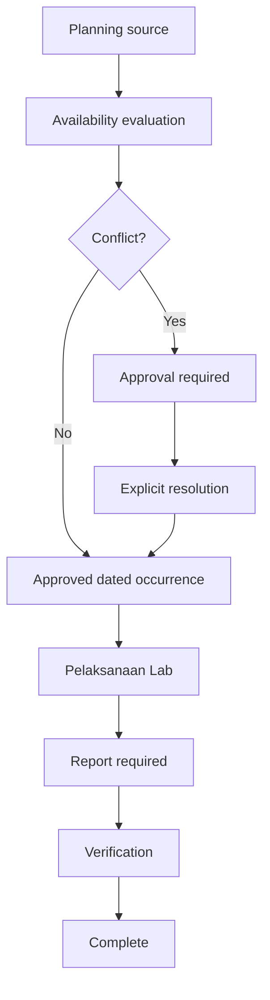
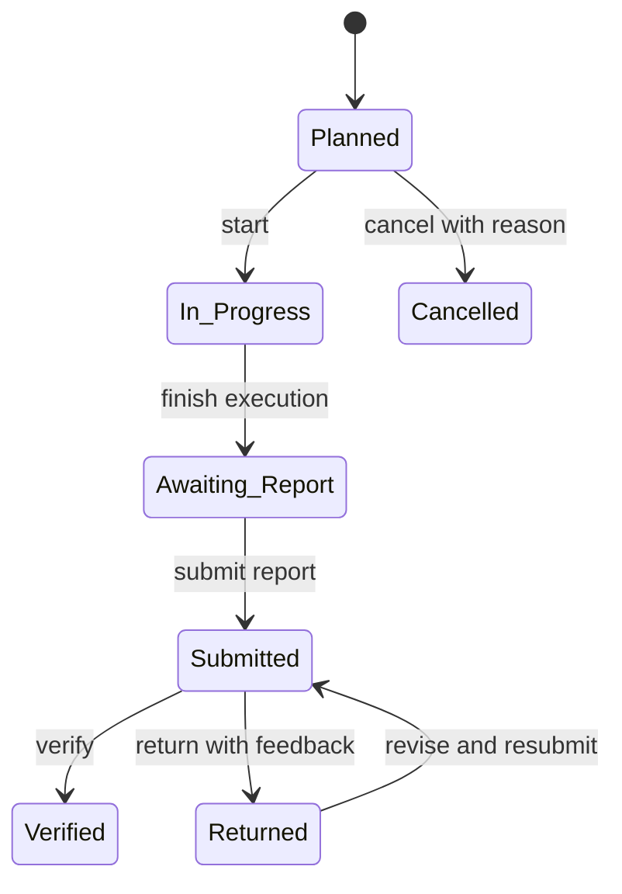
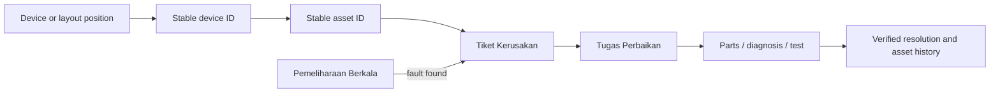

# SmartLab Operational Workflow Specification

**Status:** Approved Product Direction

**Version:** 1.0

**Updated:** 2026-07-30

**Product:** SmartLab PPLG

**Audience:** product owner, school laboratory leadership, curriculum staff, teachers, technicians, administrators, designers, and engineering teams.

This document is the source of truth for approved operational workflow direction. **Current implementation** is demonstrable behavior in the React frontend; **Approved target behavior** is the agreed direction; **Future implementation** needs a focused PR; **Out of scope** is not authorized by this document. It does not rename routes, migrate data, change permissions, or replace contracts.

## 1. Product purpose and technical boundary

SmartLab coordinates safe laboratory use, practical-learning records, device and asset operations, maintenance, and accountable administration for PPLG: plan a room, run an activity, record its result, report a problem against a stable asset, repair it, and retain history.

The target architecture is React web/PWA with Capacitor mobile delivery, Laravel REST API, PostgreSQL, Redis, a Go Windows PC agent, and `packages/contracts` as the HTTP/realtime contract source. The current web app uses repository abstractions backed by browser storage as a frontend prototype; it is not the future system of record.

**Out of scope:** remote desktop control, keylogging, screenshots, personal-file collection, a full academic-information system, procurement end-to-end, and backend/API/schema change in this documentation PR.

## 2. Approved information architecture and terminology

Approved target labels clarify scope. Existing routes remain unchanged until focused route and permission migration work is approved; existing session and journal records must never be deleted as a terminology change.

| Current label | Approved target label | Purpose | What it is not | Current route | Planned implementation notes |
| --- | --- | --- | --- | --- | --- |
| Dashboard | Dashboard | Operational summary and exceptions. | Transaction source of truth. | `/dashboard` | Later use real aggregates. |
| Laboratorium | Laboratorium | Room identity, capacity, status, layout. | Device inventory list. | `/laboratories` | Add safe lifecycle later. |
| Jadwal Lab | Jadwal Reguler | Recurring teaching allocation. | One-off request. | `/schedules` | Feed shared availability. |
| Booking Lab | Reservasi Lab | Requested date-specific use outside regular allocation. | Recurring timetable or priority override. | `/bookings` | Approval + shared availability. |
| Sesi Praktikum | Pelaksanaan Lab | Dated execution and activity record. | Calendar entry alone. | `/sessions` | Unify experience with journal. |
| Jurnal Praktikum | Incorporated into Pelaksanaan Lab | Evidence/report for completed execution. | Separate allocation source. | `/journals` | Preserve data; migrate experience later. |
| Monitoring PC | Monitoring Perangkat | Managed-device health, identity, status, alerts. | Fixed-asset registration. | `/monitoring` | Replace simulation incrementally. |
| Inventaris | Aset Tetap | Individually accountable durable assets. | Consumable stock. | `/assets` | Stable device/asset link. |
| Persediaan | Stok & Spare Part | Quantified consumables and repair parts. | Individually registered fixed asset. | `/stock` | Backend transactions later. |
| Laporan Kerusakan | Tiket Kerusakan | Issue, impact, triage, resolution evidence. | Repair assignment itself. | `/incidents` | Require stable references when applicable. |
| Work Order | Tugas Perbaikan | Assigned corrective work, diagnosis, parts, verification. | Preventive plan. | `/work-orders` | May originate from incident. |
| Maintenance | Pemeliharaan Berkala | Planned preventive work and checklist. | Reactive incident or corrective queue alone. | `/maintenance` | Creates availability closures. |
| Peminjaman | Peminjaman Barang | Equipment custody and return. | Room reservation. | `/loans` | Keep handover history. |
| Kalender Akademik | Kalender Akademik | Academic dates and closures. | Allocation engine. | `/calendar` | Supplies closures/exceptions. |
| Laporan dan Analitik | Laporan & Analitik | Filters, exports, decision summaries. | Live operational editing. | `/reports` | Use validated data. |
| Notifikasi | Notifikasi | Recipient action/inbox items. | Immutable audit trail. | `/notifications` | Valid deep links/delivery state. |
| Pengguna | Pengguna | Login-capable accounts. | Complete teacher master. | `/users` | Teacher may lack login; technician/admin may lack teacher record. |
| Role dan Permission | Hak Akses | Role and granular access administration. | Security boundary by itself. | `/roles` | Laravel policies authoritative. |
| Master Data | Master Data | Controlled reference and academic masters. | User accounts. | `/master-data` | Import later. |
| Audit Log | Audit Log | Append-oriented material-change evidence. | Notification/task list. | `/audit-logs` | Backend coverage later. |
| Pengaturan | Pengaturan | School/product configuration. | Policy bypass. | `/settings` | Tenant-aware backend later. |

| Target navigation group | Items |
| --- | --- |
| Operasional | Dashboard; Laboratorium; Jadwal Reguler; Reservasi Lab; Pelaksanaan Lab |
| Aset dan Pemeliharaan | Monitoring Perangkat; Aset Tetap; Stok & Spare Part; Tiket Kerusakan; Tugas Perbaikan; Pemeliharaan Berkala; Peminjaman Barang |
| Informasi | Kalender Akademik; Laporan & Analitik; Notifikasi |
| Administrasi | Pengguna; Hak Akses; Master Data; Audit Log; Pengaturan |

These distinctions are deliberate: regular schedule vs reservation; execution vs report; monitoring vs fixed asset; fixed asset vs stock; incident vs work order vs preventive maintenance; notification vs audit log; and teacher master vs user. Future focused PRs will migrate labels, routes, and permissions while preserving links and data.

## 3. Planning, availability, and priority events

### 3.1 Allocation sources

The approved model has three sources: **Jadwal Reguler** (recurring curriculum allocation), **Reservasi Lab** (requested, approved/rejected date-specific allocation), and **Kegiatan Prioritas** (authorized high-priority date-specific activities: TKA, ANBK, examinations, certification, LKS, workshops, or another authorized activity).



### 3.2 Unified availability engine

**Approved target behavior:** one engine evaluates schedules, reservations, priority events, maintenance closures, academic closures, and exceptions. It detects laboratory/teacher/class overlaps, duplicate usage, inactive lab, capacity, maintenance closure, and approved-reservation conflict.

**Current implementation:** schedules and bookings are separate frontend collections; booking validates only other bookings on its own screen. A shared target engine does not exist.

**Future implementation:** focused availability-domain work and Laravel contract/API ownership.

**Out of scope now:** treating client-side checks as concurrency or authorization guarantees.

### 3.3 Priority override

A priority event is date/time-specific and never deletes a recurring schedule. It previews affected occurrences, requires authorized approval, records an explicit resolution, notifies affected parties, writes audit evidence, and restores the underlying allocation on cancellation. Resolution is move to another lab, move to another time, cancel the affected occurrence, or retain it when no conflict exists. Requesters cannot override allocations. The target permission is `reservations.override` or an equivalent finalized in the future contract.

Conceptual `SpecialEvent`: stable ID, type, title, date/time, lab, requester, approval, reason, audit references. Conceptual `ScheduleException`: stable ID, schedule ID, occurrence date, resolution, replacement details, approver, reason, audit references. These are target concepts, not current schema instructions.

## 4. Pelaksanaan Lab and activity reporting

The approved experience combines Sesi Praktikum and Jurnal Praktikum into **Pelaksanaan Lab**. Conceptually it retains separate `Session` and `ActivityReport` records in a 1:1 relationship; a cancelled execution has no report. Current journal/session data is retained; any migration is explicit and audited.

Target tabs: **Hari Ini**, **Sedang Berlangsung**, **Menunggu Laporan**, **Riwayat & Laporan**. Statuses: **Planned → In Progress → Awaiting Report → Submitted → Verified / Returned**, with **Cancelled** before completion.



Reports have autosaved drafts while editable; reminder behavior is configurable, not fixed here. Manual reports are only for authorized backfill, migration, emergency, or legacy cases, with reason and source. No silent deletion or false execution linkage is allowed.

| Variant | Required target content |
| --- | --- |
| Praktikum Reguler | objective, subject/topic, class, teacher, attendance, material/software, steps, initial/final condition, issues, incident references, attachments, reflection, verification |
| TKA/ANBK/Ujian | event type, participant/class, schedule, proctor/technician, device readiness, attendance, incident/continuity record, accommodations, evidence, verification |
| Workshop/Pelatihan | organizer, participants, agenda, facilitator, resources, attendance, outputs, issues, attachments, verification |
| Kegiatan umum | classification, requester/owner, purpose, participants, equipment/room use, outcome, issues, attachments, verification |

## 5. Device, asset, incident, and maintenance chain

A device or layout position resolves to stable device ID and, when mapped, stable asset ID. Incident records source, impact, evidence, and execution context. Triage may create corrective work orders; work records diagnosis, action, spare parts, cost, test result, assignee, verification. Preventive maintenance is independent and can create a corrective incident on failure.



**Current implementation:** monitoring has simulated heartbeats/random changes and some relationships are frontend-only or free text. **Approved target:** no ambiguous broken-PC selection; layout, device, asset, incident, work order, and maintenance history trace by stable IDs. **Out of scope:** invasive agent surveillance.

## 6. Laboratory layout model

Target layout types: classroom/grid, perimeter plus center islands, rows, U-shape, custom. Required elements: entrance, exit, teacher desk, projector/display, network equipment, power/UPS, PC/workstation, printer, storage, safety equipment, aisles, and accessibility clearance.

Conceptual 36-PC perimeter-and-islands arrangement (not a hard-coded grid/UI mandate):

```text
Entrance  [PC01][PC02][PC03][PC04][PC05][PC06]
          [PC07]                         [PC08]
          [PC09]  [PC13][PC14][PC15][PC16] [PC10]
Teacher   [PC11]  [PC17][PC18][PC19][PC20] [PC12]
Desk      [PC21]  [PC25][PC26][PC27][PC28] [PC22]
          [PC23]  [PC29][PC30][PC31][PC32] [PC24]
Exit      [PC33][PC34][PC35][PC36]  Projector / Display
```

Moves validate target cell, collision, permitted type, capacity/clearance, and stable reference. Explicit user-selected swap is allowed only for compatible movable workstations; otherwise collision rejects. Occupied coordinates are unique; device moves retain device/asset ID and create audit evidence. Conceptual layout fields: stable ID, laboratory ID, type, label, row/column or geometry, device ID, asset ID, movable flag, metadata, audit/version reference.

**Current implementation:** grid dimensions and device-position updates exist. **Future implementation:** integrity and full element model; coordinates must never become device identity.

## 7. Theme behavior

Approved target supports **Light**, **Dark**, and **System**. The current UI store exposes all three, but application bootstrap applies dark after hydration and can override stored light/system preference. This records the defect only; a focused settings/UI PR fixes it with regression coverage.

## 8. Academic master data and Excel import

Future master data includes teachers, classes, subjects, academic years, semesters, laboratories, and controlled references. A teacher is an academic master separate from a login: a teacher may lack credentials, and an admin/technician account may lack a teacher record.

Excel import flow: select template → map/validate columns → preview → choose mode → resolve row errors → confirm → audit result. Modes: **create only**, **update by stable code**, **upsert by stable code**. Stable code—not display name—is the match key. Required features: required-column checks, row-level errors, duplicate preview, confirmation, audit summary. Exclusions: silent deletion of absent rows, replacement of unrelated records, or user-access grants.

## 9. Roles and authorization boundary

| Role | Intended operational focus |
| --- | --- |
| Super Admin | Platform/school configuration and recovery. |
| Kepala Sekolah | Executive visibility and oversight. |
| Wakil Kurikulum | Curriculum scheduling coordination. |
| Kepala Laboratorium | Allocation, verification, operational accountability. |
| Teknisi | Device health, incidents, repair, maintenance. |
| Guru | Assigned execution, reports, reservations, issue reporting. |
| Operator | Authorized administration and coordination. |
| Auditor | Read-only evidence and audit access. |

Permission keys/mappings remain conceptual until future contract alignment. Frontend guards are usability controls; Laravel policies and server validation are the security boundary.

## 10. Current capability gaps

| Area | Current implementation | Approved direction/gap |
| --- | --- | --- |
| Availability | Separate schedule/booking checks; booking checks bookings only. | One authoritative cross-source engine. |
| Priority | No special-event/exception model. | Date-specific authorized override with preview/audit. |
| Execution/report | Separate menus/routes; finishing can create draft journal. | Unified experience, linked records, verification. |
| Monitoring | Simulated heartbeats/random metrics. | Approved agent telemetry and stable linkage. |
| Layout | Grid position editing. | Rich elements and collision/ID integrity. |
| Asset and stock | Separate flows. | Keep distinct; backend transactional repair use. |
| Reports | Screens/export, not validated analytics model. | Authoritative data-quality rules. |
| Notifications | Read/delete/open in-app items. | Recipient delivery and valid deep links. |
| Audit | Some frontend audit events. | Append-oriented backend coverage. |
| Theme | UI store persists modes; bootstrap forces dark. | Honour stored Light/Dark/System. |
| Lab deletion | Requires dependency-guard review. | Do not orphan operational history. |
| Imports | No approved academic import. | Previewed code-matched auditable import. |

## 11. Delivery roadmap

| Stage | Purpose | Dependencies | Deliverable | Risk | Suggested branch |
| --- | --- | --- | --- | --- | --- |
| 1 | Terminology/navigation migration | This spec | Labels, redirect/deep-link plan | Broken links | `feat/operational-navigation` |
| 2 | Academic master foundation | Contracts/data ownership | Teacher/class/subject/year/semester model | User-teacher confusion | `feat/academic-master-data` |
| 3 | Import workflow | Stage 2 | Templates, preview, validation, audit | Overwrite | `feat/master-data-import` |
| 4 | Availability domain | Stages 1–2 | Unified evaluation | Concurrency | `feat/lab-availability-engine` |
| 5 | Regular schedules | Stage 4 | Recurrence and occurrences | Recurrence edges | `feat/regular-schedules` |
| 6 | Reservations | Stage 4 | Approval lifecycle | Double booking | `feat/lab-reservations` |
| 7 | Priority events/exceptions | Stages 4–6 | Preview, resolution, audit | Authority unclear | `feat/priority-event-overrides` |
| 8 | Pelaksanaan Lab | Stages 5–7 | Execution queues | Legacy duplication | `feat/lab-execution` |
| 9 | Activity reports | Stage 8 | Variants, drafts, verification | Evidence completeness | `feat/activity-reports` |
| 10 | Device/asset integrity | Asset/contracts | Stable linkage | Legacy ambiguity | `feat/device-asset-integrity` |
| 11 | Incident/work-order chain | Stage 10, stock | Triage, repair, parts | Stock consistency | `feat/incident-work-order-flow` |
| 12 | Maintenance/layout | Stages 4, 10 | Closures/checklists/layout | Unsafe movement | `feat/maintenance-and-layout` |
| 13 | Notifications/audit/reporting | Authoritative events | Delivery, audit, analytics | Misleading data | `feat/operational-observability` |
| 14 | Hardening/rollout | Applicable stages | UAT, migration, backup, access review | Production migration | `chore/operational-rollout` |

Not all stages are P0. Each must be scoped separately; no stage changes backend authority merely because it appears in this roadmap.

## 12. Future PR done checklist

A future PR is done only with scope/dependency review; migration/contract notes where applicable; server validation and authorization; stable IDs and deletion/orphan handling; material-change audit; critical business/permission tests; deep links; loading/error/empty states; manual acceptance scenarios; lint/typecheck/build plus relevant backend checks; and no unrelated refactor. UI must retain SmartLab’s responsive operational design.

## 13. Decision log

| ID | Decision | Status | Rationale | Consequence | Dependency |
| --- | --- | --- | --- | --- | --- |
| DEC-001 | Approved labels without route changes here. | Approved | Clarify without breakage. | Route work separate. | Navigation PR. |
| DEC-002 | Three planning sources. | Approved | Separates recurring/requested/priority use. | One engine evaluates all. | Availability. |
| DEC-003 | Date-specific, non-destructive priority override. | Approved | Preserve history. | Exceptions/audit required. | Reservation model. |
| DEC-004 | One availability engine. | Approved | Consistent conflicts. | Backend authority required. | Contracts/Laravel. |
| DEC-005 | One execution/report experience. | Approved | Reduce duplicate teacher entry. | Linked records remain separate. | Execution/report work. |
| DEC-006 | Manual reports exceptional and attributed. | Approved | Evidence integrity. | Reason/source/auth needed. | Report policy. |
| DEC-007 | Stable device/asset identity. | Approved | Trace incidents/repairs. | Coordinates are not identity. | Device/asset model. |
| DEC-008 | Separate incident, corrective, preventive work. | Approved | Different operational purpose. | Cross-link, do not merge. | Workflow contracts. |
| DEC-009 | Teachers separate from users. | Approved | Login is not teaching identity. | Controlled optional link. | Academic master. |
| DEC-010 | Imports match stable code; never silent delete. | Approved | Protect school data. | Preview/error/audit required. | Import service. |
| DEC-011 | Laravel policies secure data. | Approved | Frontend guards bypassable. | UI guards supplemental. | Backend auth. |
| DEC-012 | Light/Dark/System theme. | Approved | Preference/accessibility. | Stop bootstrap forced dark. | Settings PR. |

## 14. Open questions

1. Which roles may approve priority overrides, and what escalation applies if unavailable?
2. Which capacity policy governs a lab: enrollment, attendance, workstations, accessible stations, or combination?
3. What verification SLA and escalation applies for each report type?
4. Which academic system governs teacher/class/subject/schedule codes and imports?
5. Which maintenance states close a lab, versus reducing usable capacity?
6. Which notification channels, retention, preferences, and delivery guarantees are required?
7. What legacy-data quality threshold and reconciliation process is acceptable before backend cutover?
